title: WordPress como CMS
author:
  name: Jorge Epuñan
  url: http://www.i2btech.com
theme: I2BTech/cleaver-i2btech
style: css/style.css
output: index.html
controls: true

-- centrado


--

# I2B Technologies
##WordPress como CMS

--

###Temas:
- 1. Qué es realmente WordPress
- 2. Cómo hacer que WordPress haga lo que necesitamos
	- 2.1. Estructura base
	- 2.2. Posts
	- 2.3. Pages
	- 2.4. Custom Post Type
	- 2.5. Taxonomies
		- 2.5.1. Categories / Tags
		- 2.5.2. Custom Taxonomies

--

###Temas:
- 2.6. Diseccionando una plantilla
	- 2.6.1. El loop();
	- 2.6.2. Tags comunes
	- 2.6.3. Condicionales
	- 2.6.4. Snippets
- 2.7. Custom fields
	- 2.7.1. Meta boxes
- 2.8. Menúes

--

###Temas:

- 2.9. Plugins, Widgets
- 2.10. Performance, caching
- 2.11. Seguridad

-- bg-cover wordcamp

###Porqué estoy YO aquí (y no otro)

- Por muchos años desarrollando en WordPress: *blogs, sitios, intranet...* lo que sea.
- Organicé la primera -y única- [WordCamp en Chile](http://chile.wordcamp.org/), año 2010.
- Colaborador en un par de sitios.

-- bg-cover ampersand

###Porqué estoy YO aquí (y no otro)

- Activamente contribuyendo para proyectos OpenSource
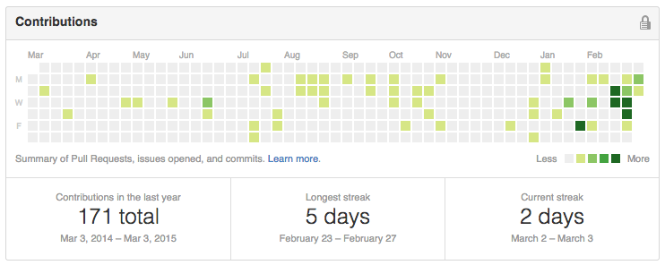
- Me gusta la tipografía y caligrafía, especialmente el caracter `&`

-- image-300 to-right

###Qué es realmente WordPress

- Un CMS
- Utilizado por 14MM+ sitios del mundo mundial
- Lo que es un 48.7% del total de sitios del mundo 

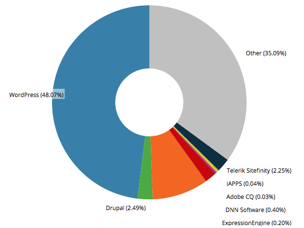

*[fuente](http://trends.builtwith.com/cms)*

--

####Pro's ✌:

- Es SEO-friendly, desde sus inicios
- Robusto, confiable
- Flexibilidad y extensibilidad
- Limpieza del código generado
- Necesita pocos recursos
- Es open-source, comunidad muy activa y mucha documentación
- Dashboard simple y amigable *out-of-the-box*
- Control de revisiones para contenido y editor de imágenes  embutido

--

####Contras ☹:
- Susceptible a ataques y vulnerabilidades si no se sabe utilizar
- Vista-controlador están integrados
- A medida que crece en contenido, disminuye en performance

--

####RoadMap:

- 2003: primer release 
	- fork de *b2 cafelog*
- 2004: versión 1.0 
	-  *plugins* en v1.2
	-  *themes*, *pages* en v1.5

--

####RoadMap:

- 2005: versión 2.0
	- *caching*, administración de usuarios y nueva UI en dashboard en v2.0
	- *widgets* en v2.1
	- *tags*, *permalinks* y *taxonomy* en v2.3
	- *post revisions* en v2.5
	- nueva UI en dashboard en v2.7
	- *image editing* en v2.9

--

####RoadMap:

- 2010: versión 3.0
	- *custom post types*, *custom taxonomies*, *custom menu* y *multisite* en v3.0
	- *theme customizer* en v3.4
	- soporte para audio y video en v3.6
- 2014: versión 4.0

-- to-right

####Ejemplos de lo que puede hacer WordPress

#####pepsialmaximo.cl
- comunidad ([BuddyPress](https://buddypress.org/))
- file upload / votos / ranking 
- muro / galerías / chat / foro
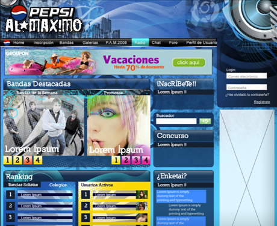

-- to-right image-300

####Ejemplos de lo q puede hacer WordPress

#####juntoscontralasilicosis.cl
<br>
- blog
- inscripción de usuarios
- biblioteca de documentos
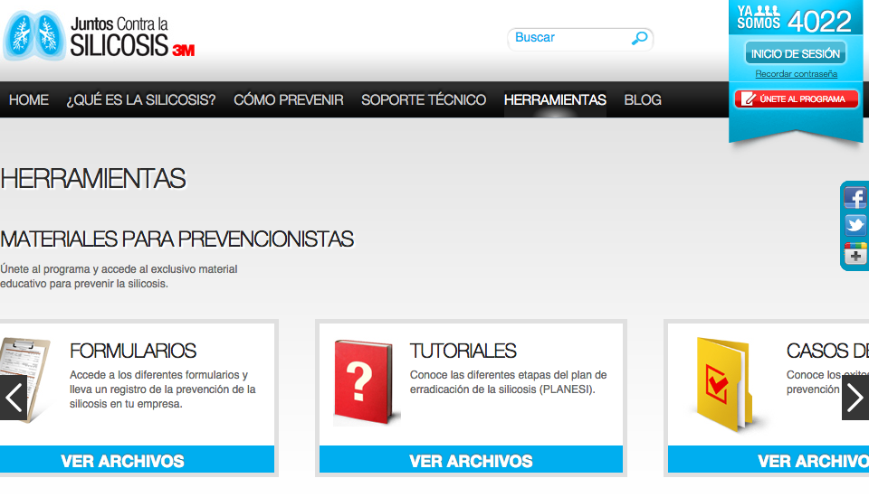

-- to-right image-300

####Ejemplos de lo q puede hacer WordPress

#####3msalud.cl
- multisite, cms, blog
- inscripción de usuarios
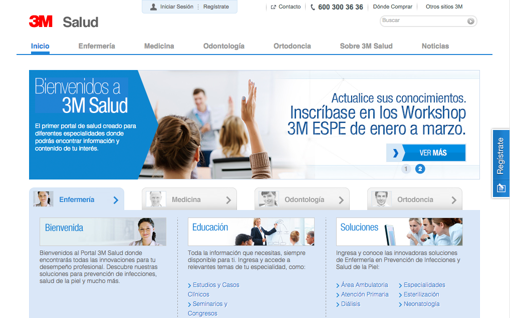

-- to-right image-300

####Ejemplos de lo q puede hacer WordPress

#####3msalud.cl

- biblioteca de documentos
- perfilamiento de usuarios
- muchos formularios
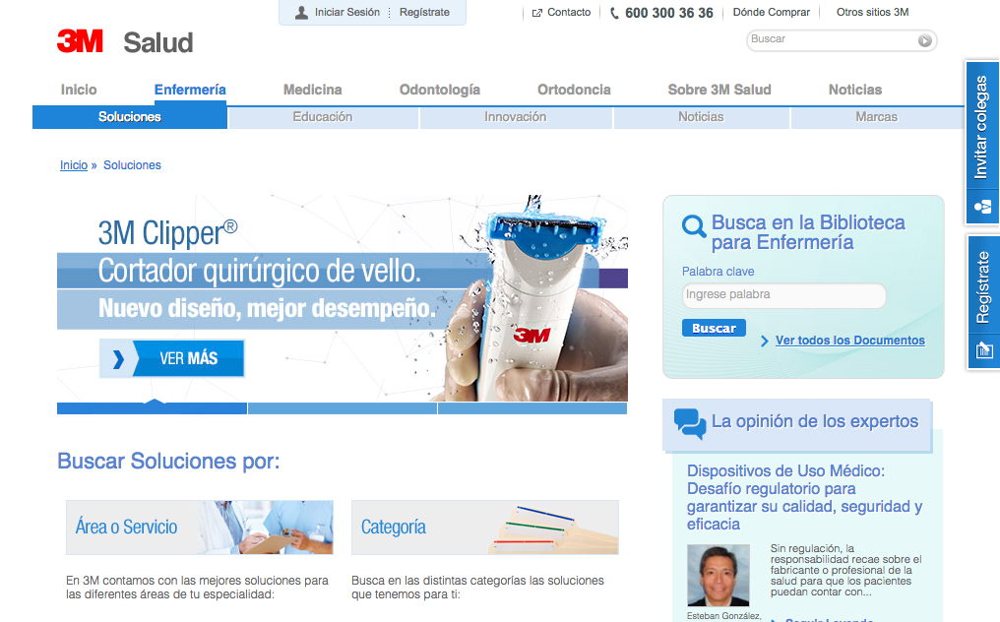

-- to-right image-300

####Ejemplos de lo q puede hacer WordPress

#####almagro.cl

- custom-post-type
- custom-taxonomy
- simuladores
- galerias
- blog
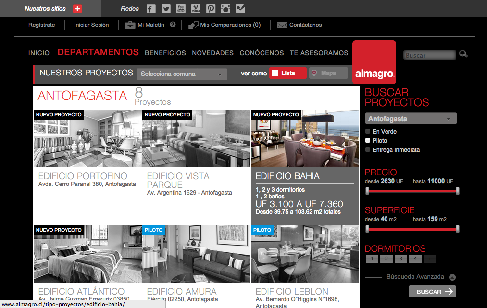

-- to-right

####Ejemplos de lo q puede hacer WordPress

#####almagro.cl

- inscripción de usuarios
- perfilamiento de usuarios
- muchos formularios
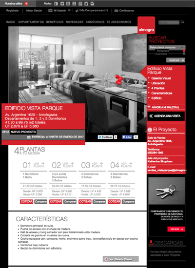

-- to-right image-300

####Ejemplos de lo q puede hacer WordPress

#####padrinos.mariaayuda.cl

- custom-post-type
- custom-taxonomy
- inscripción usuarios
- dashboard customizado

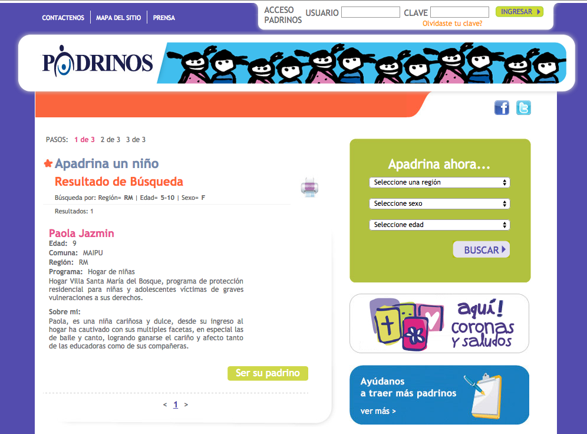

-- to-right image-300

####Ejemplos de lo q puede hacer WordPress

#####buscandriu.cl

automatización de:
- creación de posts
- asignación de categorías y taxonomías
- twitteo cuando publicado
- notificación

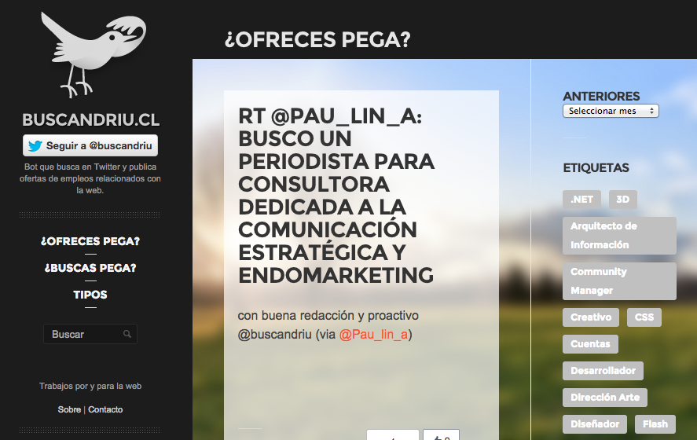

-- bg-cover dashboard

#Cómo hacer que WordPress haga lo que necesitamos

--

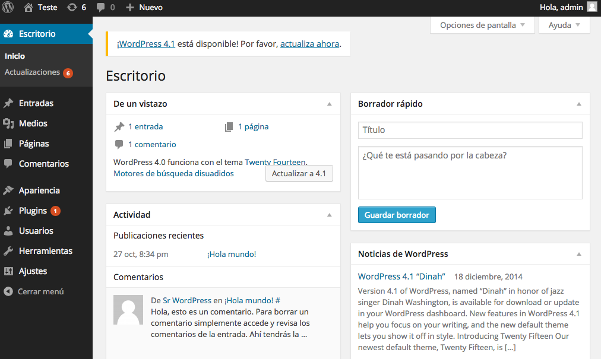

-- image-400

####2.1. Estructura base


--

####2.2. Posts

- Remanente de su período *blog engine*
- No permite ser removido, funcionalidad base y permanente
- Sindica y fecha su contenido
- Utiliza categorías/tags

-- to-right

####2.3. Pages

- Se utiliza para contenido estático
- No permite ser removido, funcionalidad base y permanente
- Permite generar jerarquía
	- Página padre ☞ página hija ☞ página nieta
- Permite utilizar diferentes plantillas y ser reordenada (precariamente)


--

####2.4. Custom Post Type

> Permite extender tipos de contenido (aunque Posts y Pages son tipos de post_type) mediante la función `register_post_type();`
> Se define en functions.php de cada plantilla

--

####2.5. Taxonomies

> Permite agrupar contenido de un mismo tipo con ciertos criterios

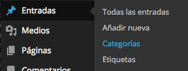

-- to-right

####2.5.1. Categories / Tags

> Son las taxonomías por defecto para *Posts*, no permite removerse

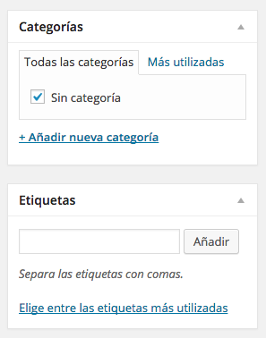

--

#####Categories:
- Permite agrupar contenido y recorrerlos según su nombre y crear jerarquía. En general ya están pre-definidos aunque permite crearse nuevos a medida que se necesite.
- Genera URL del tipo: `categoria/nombre`.

--

#####Tags:
- Definen contenido y aunque también permite recorrerlos según su nombre, no es su función. Ayudan al SEO si son bien utilizados y pueden servir como *keywords* ó *microdata*.
- Genera URL del tipo: `etiqueta/nombre`.
- Permite crear *nube de tags*. ☠

--

####2.5.2. Custom Taxonomies

- Permite crear, agrupar y recorrer contenido de cualquier tipo y de cualquier manera imaginable.
- Genera URL del tipo: `nombrecustomtaxonomy/nombre`.
- Permite crear *nube de tags*. ☠
- Se define en functions.php de cada plantilla

--

#####Ejemplo
- Crearemos una taxonomía para *persona*.
- Para cada *persona* crearemos nombres, por ej. *Pedro*.
- Permite tener URL's del tipo `persona/pedro`.
- Podemos mostrar, para el tipo de post requerido, todas las personas que exiten con ese *custom taxonomy* y con el nombre *Pedro*.

-- 

####2.6. Diseccionando una plantilla

Un theme de Wordpress se compone de varios archivos que cumplen funciones específicas según su lugar en la estructura funcional, pero básicamente se necesitan sólo 2 archivos:

- index.php
- style.css

*[WordPress Starter Theme](https://github.com/juanbrujo/WordPress-Starter-Theme)*

--

```
<!DOCTYPE html>
<html <?php language_attributes(); ?>>
<head>
<meta charset="<?php bloginfo( 'charset' ); ?>" />
<title><?php wp_title( '|', true, 'right' ); bloginfo( 'name' ); $site_description = get_bloginfo( 'description', 'display' ); echo " | $site_description"; ?></title>
<link rel="stylesheet" type="text/css" media="all" href="<?php bloginfo('stylesheet_url'); ?>" />
<?php wp_head(); ?>
</head>
<body <?php body_class(); ?>>
	<?php if ( have_posts() ) : while ( have_posts() ) : the_post(); ?>
	<?php the_title(); ?>
	<?php the_excerpt(); ?>
	<?php endwhile; else: ?>
	¯\_(ツ)_/¯
	<?php endif; ?>
	<?php wp_footer(); ?>
</body>
</html>
```
--

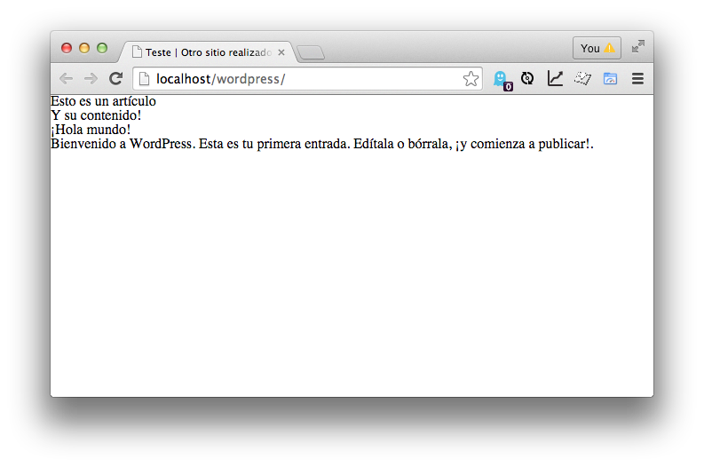

-- columns-2

- index.php
	- home.php
- single.php
	- category.php
	- tags.php
	- archive.php
	- author.php
	- date.php
	- comments.php
- 
- page.php
	- page-pageslug.php
- attachment.php
- sidebar.php
- custom-posttype.php
- taxonomy-custom.php
- search.php
- searchform.php
- 404.php
- function.php
- style.css

--


--

####2.6.1. El loop();

El loop debe estar en index.php y en toda plantilla que se use para mostrar información de su *post* o *page* para mostrar contenido referente al contenido. 

	<?php if ( have_posts() ) : while ( have_posts() ) : the_post(); ?>
	
	// CONTENIDO por ejemplo, el titulo de este post/page:
	<h1><?php the_title(); ?></h1>

	<?php endwhile; else: ?>
	
	// SI NO EXISTE, 404 o mensaje
	
	<?php endif; ?>

--

La clase `WP_Query();` te entrega más y mejores parámetros argumentos y métodos, por ejemplo, traerse los posts que estén en la categoría *Noticias*:

	<?php $query_noticias = new WP_Query( 'category_name=noticias' ); ?>

	<?php while ( $query_noticias->have_posts() ) : $query_noticias->the_post(); ?>
	// POSTS CON NOTICIAS
	<?php endwhile; ?>
	
*[WordPress Codex: The Loop in Action](http://codex.wordpress.org/The_Loop_in_Action)*

-- columns-2
#####Parámetros:

- Author
- Category
- Tag
- Taxonomy
- Search
- Post & Page
- Password
- Type
- Status
- Pagination
- Order & Orderby
- Date
- Custom Field
- Permission

--

####2.6.2. Tags comunes

*[WordPress Template Tags](http://codex.wordpress.org/Template_Tags)* | *[WordPress Chart Sheet](http://www.buildyourownblog.net/blog/time-saving-copypaste-wordpress-cheat-sheet/)*

#####General

	get_header()
	get_footer()
	get_sidebar()
	get_search_form()
	wp_meta()
	bloginfo()
	get_bloginfo()
	wp_title()
	single_post_title()
	single_cat_title()
	single_tag_title()
	wp_enqueue_script()
	
--

#####Author

	the_author()
	get_the_author()
	the_author_link()
	get_the_author_link()
	the_author_meta()
	the_author_posts()
	the_author_posts_link()
	wp_list_authors()
	get_author_posts_url()

--

#####Category y Tag
	category_description()
	single_cat_title()
	the_category()
	wp_list_categories()
	single_tag_title()
	the_tags()
	wp_tag_cloud()
	the_taxonomies()

--

#####Comments

	comment_author()
	comment_author_email()
	comment_author_IP()
	comment_author_url()
	comment_class()
	comment_date()
	comment_form()
	comment_ID()
	comment_text()
	comment_time()
	get_avatar()
	wp_list_comments()

--

#####Link

	the_permalink()
	get_permalink()
	get_attachment_link()
	get_home_url()
	get_site_url()
	home_url()
	site_url()
	get_search_link()
	get_search_query()

--

#####Post

	body_class()
	post_class()
	single_post_title()
	the_category()
	the_content()
	the_excerpt()
	the_ID()
	the_title()
	get_attachment_link()
	wp_get_attachment_link()
	the_date()
	the_time()

--

#####Navigation Menu

	wp_nav_menu()

--

####2.6.3. Condicionales

Permite crear reglas dependiendo si la condición (nativa de WordPress) existe:

*[WordPress Conditional Tags](http://codex.wordpress.org/Conditional_Tags)*

--

```
is_home()
is_front_page()
is_admin()
is_single() 			// ID | name | slug | array
is_page()				// ID | name | slug | array
is_page_template()		// filename
is_category()			// ID | name | slug | array
is_tag()				// name | slug | array
is_tax()				// name | slug | array
is_author()			// ID | name | slug | array
is_404()
is_attachment()
post_type_exists() 	// Post type name
is_plugin_active()	 // plugin name
has_post_thumbnail()   // ID
```	
	
--

####2.6.4. Snippets

*[WordPress Functions Snippets](https://github.com/juanbrujo/WordPress-Starter-Theme/blob/master/functions.php)*

	// remove WP3.1 admin bar
	add_filter('show_admin_bar', '__return_false');
	
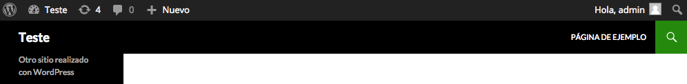

-- image-300
```	
// removing dashboard widgets
function example_remove_dashboard_widgets() {
	 global $wp_meta_boxes;
	unset($wp_meta_boxes['dashboard']['normal']['core']['dashboard_recent_comments']);
	unset($wp_meta_boxes['dashboard']['side']['core']['dashboard_quick_press']);
	unset($wp_meta_boxes['dashboard']['normal']['core']['dashboard_plugins']);
	  unset($wp_meta_boxes['dashboard']['side']['core']['dashboard_primary']);
	  unset($wp_meta_boxes['dashboard']['side']['core']['dashboard_secondary']);
	}
add_action('wp_dashboard_setup', 'example_remove_dashboard_widgets' );
```	
	


-- image-300 to-right

```	
// custom logo
function my_custom_login_logo() {
	echo '';
}
function my_custom_logo() {
	echo '';
}
add_action('login_head', 'my_custom_login_logo');
add_action('admin_head', 'my_custom_logo');
```	
	


--
```	
// remove updatenag
add_action('admin_menu','wp_hide_update');
function wp_hide_update() {
	remove_action( 'admin_notices', 'update_nag', 3 );
}
```		


--

```	
// remove theme and plugin editor
define('DISALLOW_FILE_EDIT', true);
```	
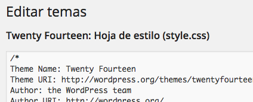

--

```	
// remove junk from head
remove_action('wp_head', 'rsd_link');
remove_action('wp_head', 'wp_generator');
remove_action('wp_head', 'feed_links', 2);
remove_action('wp_head', 'index_rel_link');
remove_action('wp_head', 'wlwmanifest_link');
remove_action('wp_head', 'feed_links_extra', 3);
remove_action('wp_head', 'start_post_rel_link', 10, 0);
remove_action('wp_head', 'parent_post_rel_link', 10, 0);
remove_action('wp_head', 'adjacent_posts_rel_link', 10, 0);
```	


--


####2.7. Custom fields

> WordPress permite que cada contenido tenga campos personalizados, del tipo *meta-data*. El tipo de información que guarda es del tipo *key => value*.

-- 

#####Ejemplo
- Fecha nacimiento => 18-febrero-1981
- Edad => 33 años

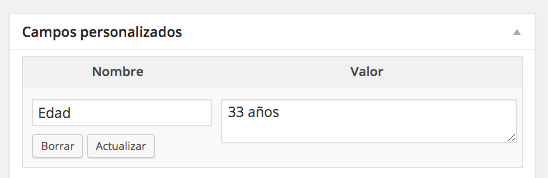

--

####2.7.1. Meta boxes

> Extensión de un *custom field* con el cual permite personalización a cada tipo de contenido.
> Se define en functions.php de cada plantilla

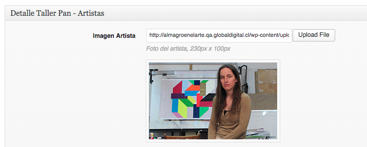

--

####2.8. Menúes

WordPress permite administrar tantos menúes como sean necesarios de forma nativa, a través de `wp_nav_menu();`


*[WordPress wp nav menu](http://codex.wordpress.org/Function_Reference/wp_nav_menu)*

--

####2.9. Plugins, Widgets

Plugins y Widgets extienden funcionalidades nativas y crean nuevas que no existen en el core de WordPress.

*[WordPress.org Plugin Directory](https://wordpress.org/plugins/)*

--

#####Plugin: 

> Pieza de código funcional independiente de la plantilla, se activa para todo WordPress.

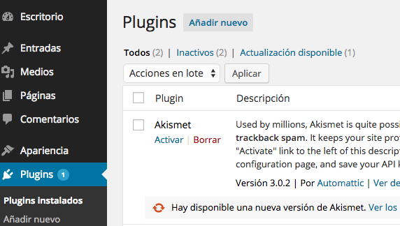

--

#####Widget: 
> Pieza de código funcional dependiente de la plantilla y que tiene directa relación con la interfaz, permite ser ubicado en determinadas zonas de la plantilla y posee un sistema de administración propio mediante drag & drop.


--

#### Ejemplo

[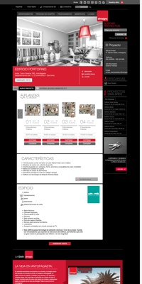](images/complete-proyecto.jpg)
[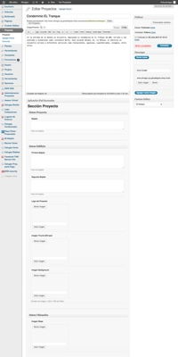](images/complete.jpg)

--

####2.10. Performance & Caching

#####Plugins
- Desactivar todo plugin que no esté en uso.
- WordPress tiene su propio sistema de caché, úselo: `define('WP_CACHE', true);`
- Trabajar con métodos propios de WordPress que privilegian su propio caché como `get_option();` y `update_option();`

--

#####Themes
- Optimizar upload de imágenes: 
```
add_theme_support('post-thumbnails')
add_image_size('imagen_post', 220, 220, false); 
```
- Combina múltiples archivos .css y .js en los mínimos posibles, minificados.
- Privilegia valores estáticos (en bruto) en la plantilla que no cambiarán con el tiempo, por ejemplo:
`<html <?php language_attributes(); >>`
`	<meta charset="<?php bloginfo('charset'); ?>">`

--

#####Plugins & Server caching
- [W3 Total Cache](http://wordpress.org/extend/plugins/wp-super-cache/)
- [Varnish](https://www.varnish-cache.org/)
- Evaluar llamar archivos estáticos desde un CDN como videos, imágenes.
- Disminuir el número de revisiones que se guardan por post/page: `define( 'WP_POST_REVISIONS', 3 );`
- Evaluar un stack LEMP: Linux + Nginx + MySQL + PHP5-APC
- Externalizar el servicio de Feed (RSS) a [Feedburner](http://feedburner.google.com/).

--

####2.11. Seguridad

- Mantener actualizado WordPress y sus plugins
- Evitar utilizar plugins hecho por terceros
- Borra toda plantilla, plugins y archivos innecesarios o que no estén activos
- Mantener permisos de archivos y directorios correctos
- Crear reglas .htaccess correctas
- Evitar llamados SQL desde las plantillas; utiliza la clase `$wpdb();`

*[Hardening WordPress](http://codex.wordpress.org/Hardening_WordPress)*

--

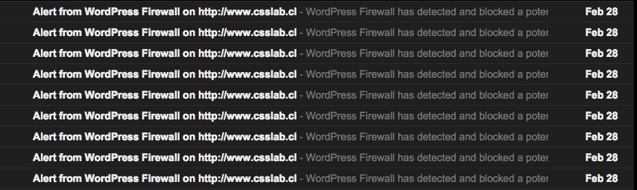
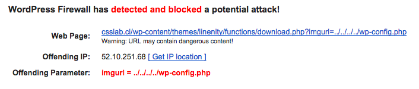

--

#####Plugins recomendados:

- [All In One WP Security](https://wordpress.org/plugins/all-in-one-wp-security-and-firewall/)
- [Wordfence Security](https://wordpress.org/plugins/wordfence/)
- [WordPress Firewall 2](https://wordpress.org/plugins/wordpress-firewall-2/)

-- bg-cover fin
